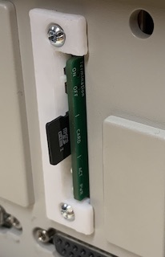
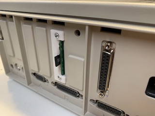
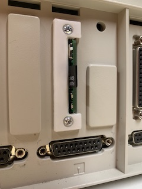
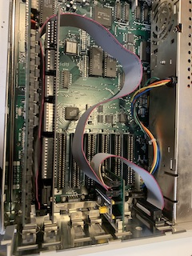
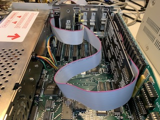
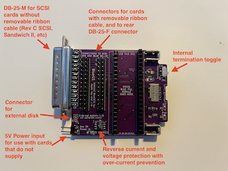
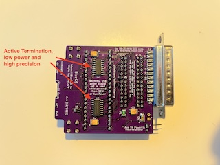

# BlueGS: Internal BlueSCSI for Apple IIgs and //e

*BlueGS* is the internal hard drive your Apple IIgs and //e always *craved*.

Using the [BlueSCSI](https://github.com/erichelgeson/BlueSCSI) SCSI drive emulator and your compatible SCSI card, you have a fully internal hard drive with accessible microSD slot while still keeping your DB-25 connector free for other peripherals.

# How it works

BlueGS connects between your SCSI card and its external DB-25 connector to give you a seamless installation. The BlueGS module itself mounts in a free DB-25 connector cutout in the rear of your IIgs or //e.

# Features

* Gives your Apple IIgs or //e an internal, cable-free hard drive
* Can be powered from SCSI termination power only (if present)
* "Termination Power" mod is not required (when powered from auxiliary 5V source)
* Can *provide* termination power to the SCSI bus (when powered from a 5V source such as the Game IO connector or card slot)
* Built-in termination that is controlled with a single switch
* Active termination ICs instead of passive termination resistors, reduces power consumption by over 2/3rds
* Reverse current and voltage protection with overcurrent prevention for auxiliary 5V input
* Connection for external drive activity LED

# Compatible SCSI cards

Tested:
* [GGLabs A2SCSI](https://gglabs.us/node/2071) - a clone of the Apple Rev C SCSI card
* Apple Rev C SCSI and clones
* Apple High-Speed SCSI ("Sandwich II")
* Ramfast SCSI

Assumed to work:
* GSE-Reactive SCSI Card

Untested:
* AMR SCSI
* Cirtech SCSI/Insyder
* SVA Hard Disk Adapter

The CMS SCSI II is currently confirmed **NOT** to work, though it appears to be a (card) firmware issue and not a "bug" with BlueSCSI.

## What if my SCSI card doesn't provide termination power?

Running BlueGS from "termination power" makes installation much easier, but not all SCSI cards have it. For more details, please check out the notes on [Powering BlueGS](POWERING_BLUE-GS.md).

# Performance

Using [BenchmarkD](https://www.brutaldeluxe.fr/products/apple2gs/benchmarked.html) with Apple IIgs (ROM 1, "Fast" speed), GS-RAM Plus w/ 2MB, GGLabs A2SCSI card. Using Blue-Pill-based BlueGS board.

* Read
  * File: 52 KB/s
  * Block-by-block: 36 KB/s
  * With 64K buffer: 79 KB/s
* Write (File): 37 KB/s

# Can I use it on things besides the IIgs and //e?

Yes! It's is a standard BlueSCSI device and uses the standard BlueSCSI V1 firmware. In fact, the built-in DB-25 connector makes it the perfect external SCSI drive as well!

BlueGS can be mounted internally in any computer that has an open cutout for a DB-25 connector.

## ✅ Compatible Apple clones

These computers *do* have rear DB-25 cutouts and so BlueGS should be able to mount properly, but are untested.

* Franklin Ace 2000/2100/2200
* Basis 108

## 🚫 Apple II/II+ and similar clones

BlueGS will function in an Apple II or II+, but you will not be able to mount it because it uses "V" shaped cutouts instead of D-Subminiature connector cutouts like the //e and IIgs have.

Many Apple II clones use the same rear cutout design and have the same mounting limitation. **A mounting solution for these machine is planned**.

* Franklin Ace 100/1000/1200
* Pravetz-8
  - Includes the -8, -82, -8M, -8A, -8E, and -8C
* Unitron (Brazil)
* Ci Base-48 and Pineapple (Korea)

# Assembly

If you purchased BlueGS as a self-assemble kit or are using your own PCBs, please follow the instructions in the "[assembly](assembly/)" directory.

If your BlueGS was purchased fully-assembled, please move on to the "[Installation](installation/)" section.
# Installation

Installation guides can be found in the "[installation](installation/)" directory.
# Schematics

[V1.4 Schematic](schematics/schematic_v1.4.pdf) (**FINAL**, recommended design)

  
Older Schematics

[V1.3 Schematic](schematics/schematic_v1.3.pdf)

[V1.2 Schematic](schematics/schematic_v1.2.pdf)

[V1.1 Schematic](schematics/schematic_v1.1.pdf)

# EDA/Kicad and Gerber Files

Kicad of current design can be found in [kicad](kicad/) directory.

# Credits

This project would not be possible without the work done by [ztto](https://github.com/ztto/ArdSCSino-stm32), [Tambo](https://twitter.com/h_koma2), [Eric Helgeson](https://github.com/erichelgeson/BlueSCSI), [Androda](https://androda.work/), and many others.

The "Blue Pill" footprint was originally created by [Yet-Another-Average-Joe](https://github.com/yet-another-average-joe/Kicad-STM32).

Symbol and footprint for Molex 105162-0001 MicroSD slot created by [SnapEDA user HMantz](https://www.snapeda.com/parts/105162-0001/Molex/view-part/).

# License

See [LICENSE.md](LICENSE.md).
