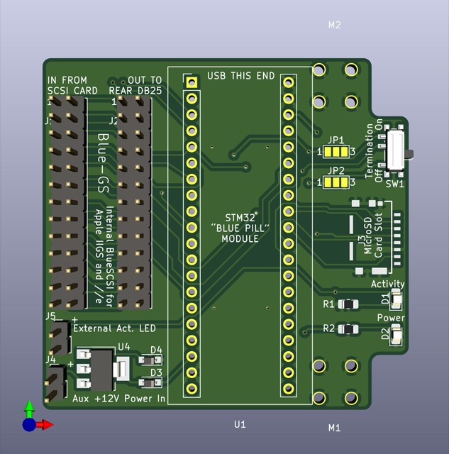

# Internal BlueSCSI for Apple IIgs and //e

<!-- TOC -->

- [Internal BlueSCSI for Apple IIgs and //e](#internal-bluescsi-for-apple-iigs-and-e)
- [About](#about)
- [Compatible SCSI cards](#compatible-scsi-cards)
- [Board](#board)
- [Assembly](#assembly)
  - [Bill-of-Materials](#bill-of-materials)
    - [Compatible Termination ICs](#compatible-termination-ics)
  - [Assembly Steps](#assembly-steps)
    - [MicroSD Slot](#microsd-slot)
    - [Switch](#switch)
    - [Set Jumpers](#set-jumpers)
    - [LEDs and Resistors](#leds-and-resistors)
    - [Termination ICs and Capacitors](#termination-ics-and-capacitors)
    - [Auxiliary +12V input regulator, diodes, and capacitor](#auxiliary-12v-input-regulator-diodes-and-capacitor)
    - [SCSI Card connections](#scsi-card-connections)
    - [Blue Pill Module](#blue-pill-module)
- [Installation](#installation)
  - [Bracket](#bracket)
  - [Cables](#cables)
  - [Auxiliary +12V connection](#auxiliary-12v-connection)
  - [Slot Attachment](#slot-attachment)
- [Usage](#usage)
- [Schematics](#schematics)
- [EDA/Kicad Files](#edakicad-files)
- [Version Changes](#version-changes)
- [Credits](#credits)
- [License](#license)

<!-- /TOC -->

# About

Using [BlueSCSI](https://github.com/erichelgeson/BlueSCSI)(SCSI drive emulator), bringing your Apple IIgs and //e the *internal* hard drive it always craved!

# Compatible SCSI cards

TBA

# Board

TBA

# Assembly

## Bill-of-Materials

TBA

### Compatible Termination ICs

TBA

## Assembly Steps

### MicroSD Slot

### Switch

### Set Jumpers

### LEDs and Resistors

### Termination ICs and Capacitors

### Auxiliary +12V input regulator, diodes, and capacitor

### SCSI Card connections

### Blue Pill Module

# Installation

## Bracket

TBA

## Cables

TBA

## Auxiliary +12V connection

TBA

## Slot Attachment

TBA

# Usage

TBA

# Schematics

[V1.2 Schematic](schematics/schematic_v1.2.pdf)

[V1.1 Schematic](schematics/schematic_v1.1.pdf)

# EDA/Kicad Files

Kicad of current design can be found in [kicad](kicad/) directory.

# Version Changes

See [CHANGES.md](CHANGES.md).

# Credits

This project would not be possible without the work done by [ztto](https://github.com/ztto/ArdSCSino-stm32), [Tambo](https://twitter.com/h_koma2), [Eric Helgeson](https://github.com/erichelgeson/BlueSCSI), and many others.

The "Blue Pill" footprint was originally created by [Yet-Another-Average-Joe](https://github.com/yet-another-average-joe/Kicad-STM32).

Symbol and footprint for Molex 105162-0001 MicroSD slot created by [SnapEDA user HMantz](https://www.snapeda.com/parts/105162-0001/Molex/view-part/).

# License

See [LICENSE.md](LICENSE.md).
